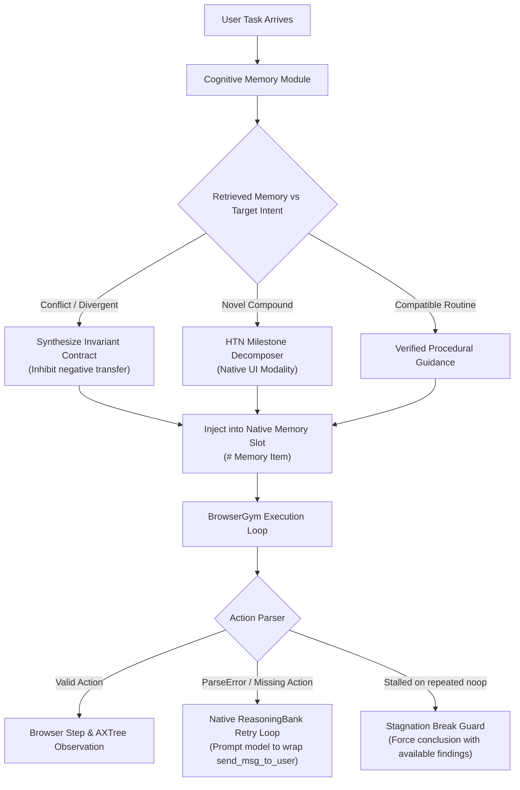

# COPROMEM 2.0 Architectural Clarification & Implementation Plan

> Implementation note (2026-09-23): BrowserGym currently verifies browser action acceptance and records observable action boundaries. Its decomposed semantic milestones are prompt guidance, not executable handoff contracts. See `COPROMEM_2.0_IDEA.md` for the proposed mechanism and its evidence limits.

This plan directly addresses three fundamental architectural questions raised after analyzing the 30-task benchmark run (`mini30`), providing clear technical answers, root-cause dissections, and an actionable implementation plan for principled execution.

---

## 1. Giải thích chi tiết 3 câu hỏi cốt lõi

### Câu hỏi 1: "Tôi tưởng benchmark context mình sẽ có từ prompt wrapper, đâu phải manual inject nữa nhỉ?"

#### Phân tích bản chất:

Bạn hoàn toàn chính xác! Trong hệ sinh thái **BrowserGym & WebArena**, toàn bộ ngữ cảnh vai trò của agent vốn đã được đóng gói sẵn và hoàn chỉnh trong **`MainPrompt` (Prompt Wrapper chính thức của ReasoningBank / BrowserGym)**:

```markdown
# Instructions (Trích xuất từ MainPrompt của BrowserGym/ReasoningBank):
You are a UI Assistant, your goal is to help the user perform tasks using a web browser.
You can communicate with the user via a chat... You have access to a web browser that
both you and the user can see, and with which only you can interact via specific commands.
Action space: click, fill, select_option, scroll, noop, send_msg_to_user...
```

#### Vậy tại sao vừa rồi lại xuất hiện biến `benchmark_context`?

- Biến `benchmark_context` **không hề được truyền vào BrowserGym agent khi chạy**.
- Nó chỉ xuất hiện bên trong module tiền xử lý **`RecursiveTaskDecomposer._factorize_via_llm(...)`** (bước gọi LLM phụ trước khi task bắt đầu để phân rã nhiệm vụ phức tạp thành 2-3 milestone).
- **Lỗi phát sinh ở đâu?**
  Khi ta cố gắng xóa bỏ mọi chữ "WebArena" khỏi codebase để tránh leakage, ta đã đổi tham số truyền vào Decomposer thành:
  `benchmark_context = "Autonomous agent operating in environment at http://localhost:7780/admin"`
  Chính chữ "operating in environment" quá chung chung này đã khiến mô hình Decomposer (vốn tách biệt với BrowserGym) tưởng rằng agent là một lập trình viên backend có quyền truy cập SQL Database, dẫn đến Milestone tai hại ở Task 1:
  > *"Establish database connection and formulate database query to select all sales records from database..."*
  >

#### Đề xuất của bạn: Dùng trực tiếp Prompt Wrapper có sẵn, loại bỏ hoàn toàn hardcode:

Ý tưởng của bạn cực kỳ chuẩn mực về mặt thiết kế hệ thống!
Thay vì tự viết bất kỳ chuỗi mô tả nào (`"UI Assistant"`, `"web interface"`,...):

- Decomposer chỉ đơn giản được định nghĩa là **`Task Decomposer`**.
- Toàn bộ ngữ cảnh hoạt động của Decomposer được lấy **nguyên bản từ chính `SystemPrompt().prompt` của môi trường**:
  ```python
  # Zero-hardcoding: Lấy trực tiếp từ environment prompt wrapper có sẵn
  system_prompt = (
      "You are a Task Decomposer.\n"
      f"Agent Environment Context:\n{SystemPrompt().prompt}\n\n"
      "Given a user intent, factorize it into 2 to 3 sequential operational milestones..."
  )
  ```
- **Lợi ích triệt để:**
  1. **Không hardcode bất kỳ chuỗi thông tin nào:** Decomposer tự động biết agent làm việc qua browser vì `SystemPrompt` sẵn có của môi trường đã viết rõ: *"You are an agent trying to solve a web task based on the content of the page... actions will be sent to the browser"*.
  2. **Tổng quát hóa 100%:** Nếu sau này benchmark chuyển sang môi trường khác (như ALFWorld hay OSWorld), Decomposer chỉ việc nhận `SystemPrompt` của môi trường đó mà không cần sửa bất kỳ dòng code nào.

---

### Câu hỏi 2: "Mình sẽ inject gì và tại sao inject? Hay chỉ inject vì task được thực hiện sai?"

Đây là câu hỏi mang tính bản chất cốt lõi của bài toán **Continual Learning (Học tăng cường liên tục)**:

#### 1. Tại sao phải inject?

- Trong các mô hình đánh giá không fine-tune (Zero-shot / In-context), LLM hoàn toàn **stateless** (mất sạch bộ nhớ giữa các episode).
- Khi agent đã tự mò mẫm giải thành công Task 41 hay Task 201, kinh nghiệm đó được lưu vào **Memory Bank**. Nếu bước sang task tiếp theo mà ta không đưa (inject) kinh nghiệm đó vào prompt, agent sẽ lại bước vào task mới với cái đầu "trắng tinh" và lặp lại 15-30 bước thử-sai vô nghĩa.
- Do đó, **inject vào prompt là con đường duy nhất** để agent kế thừa được tri thức từ quá khứ sang tương lai.

#### 2. Có phải chỉ inject vì task thực hiện sai?

- **KHÔNG.** Nếu chỉ inject khi task bị sai, đó là mô hình **Reflexion / Error Self-Correction** (phản tỉnh sửa sai cục bộ sau khi vấp ngã).
- Nhưng mục tiêu lớn hơn của **ReasoningBank và COPROMEM** là **Học liên tục từ cả Thành công lẫn Thất bại**:
  - **Khi task quá khứ THÀNH CÔNG:** Hệ thống học được quy trình chuẩn (**Positive Transfer**) để các task tương đồng sau này hội tụ thần tốc (giảm từ 30 bước xuống 1-3 bước như Task 41, 42).
  - **Khi task mới có XUNG ĐỘT với task thành công trong quá khứ:** Đây là nơi **ReasoningBank thất bại thảm hại (Negative Transfer)**:
    - Task 0 (hỏi Product) thành công $\rightarrow$ sinh ra memory *"Vào bestsellers đọc Product"*.
    - Khi gặp Task 1 (hỏi Brand), ReasoningBank thấy query giống nhau liền inject mù quáng memory Product vào $\rightarrow$ Agent đọc Product và FAIL Task 1!
    - Lúc này, **COPROMEM** phát hiện xung đột causal/constraint giữa Product và Brand thông qua **Pattern Separation Engine**, từ đó **VETO (chặn)** memory cũ và inject một **Differentiated Contract** để cảnh báo agent không dẫm vào vết xe đổ.

#### 3. Vậy cụ thể COPROMEM đang inject cái gì? (What is actually injected?)

COPROMEM chỉ inject đúng **3 loại thông tin nhận thức**, tương ứng với 3 tình huống:

| Tình huống nhận thức                                                                | Khi nào kích hoạt?                                                                                                                    | Ta inject cái gì vào Prompt?                                                                                                                                                                                                                    | Mục đích của việc Inject                                                                                                  |
| :-------------------------------------------------------------------------------------- | :--------------------------------------------------------------------------------------------------------------------------------------- | :------------------------------------------------------------------------------------------------------------------------------------------------------------------------------------------------------------------------------------------------- | :----------------------------------------------------------------------------------------------------------------------------- |
| **1. Compatible Memory** *(Ký ức tương thích)*                             | Task mới có cùng mục tiêu và ràng buộc với task đã thành công trong quá khứ.                                              | `# Memory Item: [Verified Procedural Contract]`- Quy trình thao tác chuẩn đã được kiểm chứng.- Điều kiện tiên quyết & kiểm tra đầu ra.                                                                                         | **Tăng tốc (Positive Transfer):** Giúp agent đi thẳng tới trang đích, giảm số bước từ 30 xuống 1-3 bước. |
| **2. Differentiated Contract** *(Xung đột điều kiện - Cốt lõi COPROMEM)* | Task mới có bề mặt giống task cũ nhưng xung đột ràng buộc (ví dụ: Product vs Brand, Oldest vs Newest, Pending vs Approved). | `# Memory Item: [COPROMEM Differentiated Contract]`- **Alert:** Cảnh báo xung đột cụ thể.- **Inhibition:** Ức chế thói quen cũ.- **Verification Guard:** Chốt chặn buộc phải xác minh đúng thuộc tính mới. | **Chống ngộ nhận (Inhibit Negative Transfer):** Ngăn agent bị memory cũ "dắt mũi", bảo vệ độ chính xác.    |
| **3. Multi-Stage Milestones** *(Nhiệm vụ mới phức tạp)*                    | Task mới hoàn toàn, có nhiều điều kiện ràng buộc lồng nhau (Compound Task) mà chưa có memory sẵn.                         | `# Task Execution Guidance: [Sequential Milestones]`- Milestone 1: Khoanh vùng phạm vi.- Milestone 2: Lọc / Tìm cực trị.- Milestone 3: Xác minh & Xuất kết quả.                                                                        | **Chống lạc hướng:** Ngăn agent nhảy cóc, kết luận vội vàng khi chưa kiểm tra đủ điều kiện.            |

#### 4. Vấn đề "bẫy cồng kềnh" của Macro Plan ở đợt chạy vừa qua:

- Ở lần chạy vừa rồi, với các task tái sử dụng macro, code đã inject cả một khối:
  `# Hierarchical Execution Plan [Mode: Consolidated 2-Step Macro Plan]`
  với Step 1 (Macro) và Step 2 (Delta).
- **Hậu quả tiêu cực:** Khối này quá chi tiết và cứng nhắc, khiến agent ở Task 200 nghĩ rằng *"chỉ cần làm xong Step 1 và lọc Complete ở Step 2 là xong"*, hoàn toàn quên mất việc phải sort ngày tăng dần để tìm đơn cũ nhất!
- **Định hướng tinh gọn:** Bỏ hoàn toàn định dạng "Consolidated 2-Step Macro Plan" nặng nề. Mọi memory đưa vào prompt phải quay về chuẩn **`# Memory Item`** ngắn gọn, tập trung vào **Cognitive Invariant (Ràng buộc bất biến)** thay vì cố gắng "cầm tay chỉ việc" từng click.

---

### Câu hỏi 3: "Hàm noop() là gì và tại sao vừa rồi các task bị lặp noop() từ 17-27 bước?"

#### Định nghĩa `noop()`:

`noop()` viết tắt của **"No Operation"** (không làm gì cả, chỉ chờ):

```python
noop(wait_ms: float = 1000)
# Mô tả: Không gửi bất kỳ thao tác click hay gõ phím nào vào trình duyệt, chỉ tạm dừng (mặc định 1 giây) để chờ DOM cập nhật.
```

Trong BrowserGym, `noop()` được thiết kế hợp lệ cho trường hợp trang web đang tải dở (AJAX/animation), agent cần chờ dữ liệu xuất hiện.

#### Bí ẩn tại sao Task 116, 1, 3 bị kẹt lặp `noop()` đến 27 lần:

Chúng ta đã mổ xẻ code runner (`webarena_browsergym_benchmark.py`) và phát hiện ra **lỗ hổng cực kỳ nghiêm trọng**:

```python
# Đoạn code trong webarena_browsergym_benchmark.py:
try:
    ans_dict = main_prompt._parse_answer(response_text)
    action = ans_dict.get("action", "").strip()
except Exception:
    thought, action = extract_action(response_text)

if not action:
    action = "noop()"  # <--- BẪY SILENT FALLBACK TẠI ĐÂY!
```

1. **Nguyên nhân kích hoạt:**
   - Ở Task 116, sau khi lọc review theo chữ "tank", trang web hiện ra bảng danh sách khách hàng không hài lòng (Dominic, Merrie, Carma).
   - Mô hình Gemini nhìn thấy bảng và hào hứng trả lời bằng văn phong tự nhiên:
     *"The customers who expressed dissatisfaction with tank products are Dominic, Merrie, and Carma."*
   - Nhưng Gemini **quên không bọc câu trả lời trong tag `<action>send_msg_to_user(...)</action>`**.
2. **Cơ chế sập bẫy:**
   - Hàm parser của ReasoningBank tìm không thấy `<action>`, ném ra lỗi `ParseError`.
   - Trong code chính thức của tác giả ReasoningBank (`external/reasoning-bank/WebArena/agents/legacy/agent.py`), khi gặp `ParseError`, hệ thống sẽ **gửi lại prompt yêu cầu LLM sửa sai ngay lập tức (Retry)**:
     `"ParseError: Missing <action> tag. Please provide an action."`
   - Nhưng trong code benchmark của chúng ta, khi parse lỗi, nó lại **im lặng gán `action = "noop()"`**!
3. **Vòng lặp vô tận (Infinite Stagnation Loop):**
   - Trình duyệt nhận lệnh `noop()`, đứng yên 1 giây rồi trả về nguyên vẹn trang web cũ.
   - Bước tiếp theo, Gemini lại nhìn thấy trang cũ, lại nghĩ *"mình vừa nói rồi mà, để mình nhắc lại: Dominic, Merrie, Carma"*, vẫn không có tag `<action>`, parser lại biến thành `noop()`.
   - Quá trình này lặp lại liên tục **27 bước** cho đến khi cạn kiệt giới hạn 30 bước và bị đánh FAIL!

---

## 2. Kế hoạch tái cấu trúc (Proposed Architecture Refinement)

Nhằm loại bỏ hoàn toàn các lỗi trên và đưa hệ thống về chuẩn mực khoa học, chúng ta sẽ thực hiện 3 cải tiến tinh gọn:



### Chi tiết thay đổi cụ thể:

#### 1. Xóa bỏ hoàn toàn Hardcode, Decomposer độc lập với nền tảng (Platform-Agnostic)

- **Không hardcode bất kỳ từ ngữ nào** liên quan đến web, UI, hay browsing.
- Decomposer là module nhận thức thuần túy (**Domain-Agnostic Task Decomposer**).
- Ngữ cảnh môi trường được lấy động 100% từ chính `prompt wrapper` của môi trường đang chạy (`agent_prompt_wrapper`):
  ```python
  # Hoàn toàn tổng quát cho mọi nền tảng (WebArena, ALFWorld, AppWorld, OSWorld)
  system_prompt = (
      "You are a Task Decomposer.\n"
      f"Operating Environment Context:\n{agent_prompt_wrapper}\n\n"
      "Given a complex user intent, factorize it into 2 to 3 sequential operational milestones following the Constraint Composition Principle:\n"
      "Stage 1: Scope & Prerequisite Condition Restriction\n"
      "Stage 2: Candidate Selection / Extremum Ordering\n"
      "Stage 3: Target Attribute Projection & Constraint Verification\n\n"
      "Milestones must represent observable intermediate state checkpoints in the environment. Intermediate milestones must never emit final output."
  )
  ```
- **Tác dụng:**
  - Chạy trên **BrowserGym**: `agent_prompt_wrapper` mang thông tin browser UI $\rightarrow$ Decomposer sinh milestone thao tác trang.
  - Chạy trên **ALFWorld**: `agent_prompt_wrapper` mang thông tin text-based household $\rightarrow$ Decomposer sinh milestone di chuyển/nhặt đồ.
  - Chạy trên **AppWorld**: `agent_prompt_wrapper` mang thông tin API code execution $\rightarrow$ Decomposer sinh milestone gọi API.
  - Code COPROMEM hoàn toàn sạch, zero-leakage, không thiên vị hay làm tổn hại (hurt) bất kỳ platform nào.

#### 2. Tinh giản Macro Plan về chuẩn nhẹ nhàng `# Memory Item`

- Xóa bỏ khối định dạng cồng kềnh `# Hierarchical Execution Plan [Mode: Consolidated 2-Step Macro Plan]`.
- Mọi tri thức tái sử dụng đều quay về định dạng chuẩn gọn nhẹ của ReasoningBank:
  ```markdown
  # Memory Item: [Verified Procedural Routine]
  ## Intent: ...
  ## Validated Routine: ...
  ## Verification Invariants:
  - Verify all constraints before finalizing.
  - [ORDERED SELECTION INVARIANT]: If selecting an extremum (oldest, newest, best), verify candidates are ordered by target metric before extraction.
  ```
- Tránh việc "cầm tay chỉ việc" làm gò bó suy luận trực tiếp của agent trên môi trường.

#### 3. Khôi phục cơ chế Retry chính thức của ReasoningBank khi parse lỗi

- Khi mô hình trả về text kết luận mà thiếu tag thực thi `<action>`, hệ thống kích hoạt cơ chế `retry` (tối đa 2 lần) với thông điệp:
  `"Your response did not contain an executable action. If you have found the answer, please emit: <action>send_msg_to_user('YOUR_ANSWER')</action>."`
- Chấm dứt hoàn toàn việc âm thầm gán `noop()` khi mô hình đang cố gắng trả lời.

#### 4. Kích hoạt Stagnation Break Guard

- Nếu vì bất kỳ lý do gì trình duyệt bị kẹt `noop()` quá 3 lần liên tiếp:
  Hệ thống sẽ ép dừng và yêu cầu mô hình tổng kết những gì nhìn thấy trên màn hình thay vì đốt phí phạm từ bước 4 đến bước 30.

---

## 3. Kế hoạch kiểm chứng (Verification Plan)

### Bước 1: Automated Unit Tests

Chạy toàn bộ 548 unit tests để đảm bảo các thay đổi không làm phá vỡ logic pattern separation hay credit assignment:

```bash
PYTHONPATH=. /home/levantuananh/anaconda3/envs/copromem/bin/pytest tests/ -v
```

### Bước 2: Thử nghiệm đơn lẻ trên các task từng dính bẫy noop & database

Chạy thử nghiệm độc lập trên 3 task tiêu biểu:

- **Task 116:** Kiểm tra xem mô hình có emit đúng `send_msg_to_user(...)` với danh sách khách hàng không hài lòng (Dominic, Merrie, Carma) thay vì lặp 27 lần `noop()`.
- **Task 1:** Kiểm tra xem Decomposer có sinh ra milestone web UI thay vì ảo giác database connection.
- **Task 200:** Kiểm tra xem Macro Plan có sort date ascending để lấy `John Lee` thay vì `Michael Nguyen`.

```bash
PYTHONPATH=. /home/levantuananh/anaconda3/envs/copromem/bin/python -m src.copromem.webarena_browsergym_benchmark \
  --tasks 116 1 200 \
  --arms copromem_v2 \
  --no-resume \
  --output_dir artifacts/test_stagnation_fix
```

### Bước 3: Nghiệm thu cùng người dùng

Sau khi bước 2 vượt qua và được bạn phê duyệt, mới quay lại chạy toàn diện bộ benchmark.
